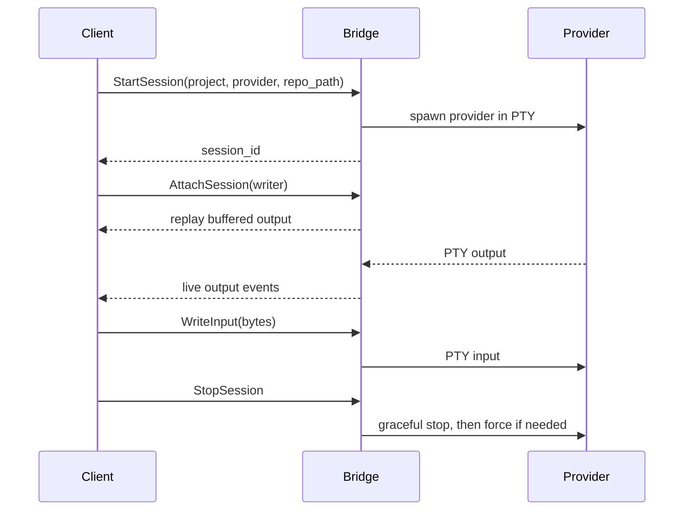

Sessions are the unit of work in AI Agent Bridge. A session belongs to a project, runs one provider in one repository path, and has a PTY event stream that clients can replay or follow live.



## Roles

| Role | Can read | Can write | Intended use |
| --- | --- | --- | --- |
| Writer | Yes | Yes | The client or operator currently controlling the PTY. |
| Observer | Yes | No | Dashboards, reviewers, and humans watching progress. |

When an operator attaches with `--take-over`, the existing writer is demoted and all observers receive a writer-change event.
The CLI waits for the server to confirm its observer attachment before claiming the writer slot, then enables terminal input and resizing after the claim succeeds.

## Start from Go

```go
resp, err := client.StartSession(ctx, &bridgev1.StartSessionRequest{
    ProjectId: "local-demo",
    SessionId: uuid.NewString(),
    RepoPath:  "/home/me/repos/bridge-demo",
    Provider:  "codex",
})
```

## Attach and Replay

```go
stream, err := client.AttachSession(ctx, &bridgev1.AttachSessionRequest{
    SessionId: resp.GetSessionId(),
    ClientId:  "watcher-1",
    AfterSeq:  0,
    Role:      bridgev1.AttachRole_ATTACH_ROLE_OBSERVER,
})
```

`AfterSeq` lets a client resume from the last event it processed. If the buffer no longer contains the requested range, the stream emits a replay-gap event.
