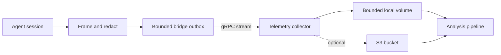

Telemetry is opt-in. The bridge writes redacted events to a bounded local
outbox before it streams immutable segments to the collector over gRPC. The
collector durably writes the same segment format to its Docker volume and can
optionally upload it to S3.



## Collect derived question telemetry

```yaml
telemetry:
  enabled: true
  collector_target: "127.0.0.1:9464"
  collector_insecure: true
  kinds: [session_started, session_context, question, answer, session_ended]
  include_redacted_text: true
  flush_interval: 10s
  max_disk_space: 1GB
```

Use `kinds: [all]` to retain both sides of the interaction as
`provider_output` and `user_input` events in addition to lifecycle, context,
question, and answer events. Full capture may contain personal or proprietary
material after best-effort redaction; enable it only with an appropriate
consent and retention policy.

## Session identity and context

Schema-v2 sessions are keyed by `(source_id, session_id)`. A
`session_context` event records OS/architecture, Git branch/commit and remote
host, plus stable HMAC identifiers for the machine, repository, and working
directory. Raw paths, repository URLs and credentials, hostnames, Git author
identity, and environment variables are not collected.

```yaml
telemetry:
  # Empty values use private files under ~/.config/bridgectl/telemetry/.
  source_id: ""
  identity_key_file: ""

  # Optional descriptive labels; these are not authenticated identities.
  actor_id: "user-7"
  source_label: "engineering-laptop"
```

The identity key is 32 random bytes stored with mode `0600`. Preserve it to
join pseudonymous repository/directory activity over time; rotate it to break
that linkage. Authenticated tenant and actor attribution belongs in the
downstream collector/application, not in these descriptive labels.

## Operate and inspect the collector

```bash
make up-collector
make ps-collector
make logs-collector
make down-collector
```

`make reset-collector` removes the collector containers and volumes after an
interactive confirmation. If the collector is unavailable, the bridge keeps
retrying from its bounded outbox. When a disk budget is exhausted, the oldest
immutable segments are evicted and a structured warning is logged.

Reports read only sealed segments, so they may lag active traffic by at most
the configured flush interval. Run the built-in question report with:

```bash
bridgectl telemetry report --events ~/.config/bridgectl/telemetry/spool
```

For downstream design examples, run the non-production metrics/API/model-packet
sample documented in
[`examples/telemetry-analysis`](https://github.com/orchael/bridgectl/tree/main/examples/telemetry-analysis).
