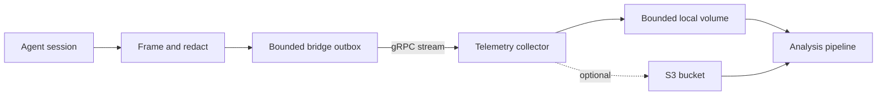

Telemetry collects analytics and inferred question/answer events. Live
[session status](session-status.md) is a separate structured-provider feature;
it works without telemetry and does not infer waits from this event stream.

Telemetry is opt-in. The bridge writes redacted events to a bounded local
outbox before it streams immutable segments to the collector over gRPC. The
collector durably writes the same segment format to its Docker volume and can
optionally upload it to S3.


```mermaid
flowchart LR
  Session[Agent session] --> Redact[Frame and redact]
  Redact --> Outbox[Bounded bridge outbox]
  Outbox -->|gRPC stream| Collector[Telemetry collector]
  Collector --> Volume[Bounded local volume]
  Collector -. optional .-> S3[S3 bucket]
  Volume --> Analysis[Analysis pipeline]
  S3 --> Analysis
```

## Collect derived question telemetry

### Isolated local Bridge/S3 smoke test

The repository-root `config.yaml` sends full redacted interaction events to
`https://bridge.orchael.dev` and uses enrollment credentials in
`/tmp/bridgectl-telemetry-test`. Start the Bridge stack with its S3 configuration
first. From the bridgectl repository root:

```bash
make build-cli
export BRIDGECTL_STATE_DIR=/tmp/bridgectl-telemetry-test
install -d -m 700 "$BRIDGECTL_STATE_DIR"
# Seed login's config discovery so it cannot fall back to your normal config.
# Keep an existing test enrollment config if this is a repeated run.
test -e "$BRIDGECTL_STATE_DIR/bridge.yaml" || (umask 077; cp config.yaml "$BRIDGECTL_STATE_DIR/bridge.yaml")
bin/bridgectl login --bridge https://bridge.orchael.dev
bin/bridgectl server start --config ./config.yaml --log-level info
```

In a second terminal, from the same repository root:

```bash
export BRIDGECTL_STATE_DIR=/tmp/bridgectl-telemetry-test
bin/bridgectl run --provider echo .
```

Type a short test message and press Enter. Wait at least 30 seconds for delivery and
check the Bridge S3 prefix for new gzip-compressed JSON objects containing `user_input` and
`provider_output`. Press **Ctrl-]** to detach. Use the same state-directory
export for `whoami`, `doctor`, `session list`, and `server stop`; otherwise those
commands target your normal installation. The daemon reads the repository config
explicitly; login updates only the seeded config and credentials in `/tmp`.
State includes the socket, enrollment, and telemetry spool.
If `/tmp` is cleared, repeat enrollment. Completeness is measured for the configured capture policy; provider activity
that has no capture hook is outside that scope.

### Delivery defaults and inspecting Bridge objects

Telemetry defaults to a 30-second flush interval; an explicit `flush_interval`
overrides it. This reduces small uploads while allowing roughly 30 seconds of
delivery delay under normal conditions. Shutdown also attempts a final flush.
The local Bridge test uses the default 10 MiB local segment limit. HTTPS delivery
splits sealed segments into requests of at most 1 MiB (including the JSON envelope)
and 1,000 events. Local segment size no longer needs to match Bridge's HTTP limit.

Bridge stores new uploads as `.json.gz` objects. To read one:

```bash
aws s3 cp 's3://orchael-bridge-telemetry-819363892004/<object-key>.json.gz' - \
  --region us-east-1 | gzip -dc | jq .
```

Existing `.json` objects remain readable with `aws s3 cp ... - | jq .`.
This compression is in the Bridge HTTPS ingestion path; the standalone gRPC
collector's JSONL storage format is unchanged.

### Completeness checkpoints and delivery recovery

Completeness tracking is on by default. The collector emits `telemetry_checkpoint`
events about every 30 seconds after queued events drain, at a session end, and on
graceful shutdown. These use sequence zero and bypass the bounded event queue.
Their `completeness` payload records the selected-event count and last sequence,
queue drops, downstream write failures, content omissions, observed start/end
boundaries, selected kinds, and whether redacted text capture is enabled. Filtered
lifecycle boundaries are still tracked. Checkpoints do not consume data sequence
numbers. An empty `capture_kinds` list means all kinds.

Checkpoints reach Bridge and S3 through the same durable spool as other events.
They let an audit detect a dropped final event, even with no later sequence gap.
The Bridge repository provides `scripts/telemetry_completeness.py` to audit a local
S3 mirror; see its `docs/telemetry-ingestion-v1.md` for the command. The audit checks
object checksums, deduplicates retries, reconstructs fragments, and reports
`complete`, `incomplete`, `open`, or `unverified` per organization/source/session.
It prints counters and missing ranges, never conversation text.

“Complete” means all events selected by the recorded policy are present, with
observed start/end boundaries and no known drops, failures, omissions, or conflicts.
It does not prove capture of uninstrumented provider activity. A crash before the
final checkpoint leaves the session open or unverified. A missing object may still
be pending locally; re-sync after successful delivery before diagnosing permanent
loss. Spool eviction appears as gaps when a checkpoint or later events survive;
if every record for a session is lost, the audit cannot discover that session.

HTTP batches have content-derived IDs and preserve each original event ID.
Oversized individual events become `telemetry_fragment` records containing indexed
base64 chunks of the exact normalized event plus its SHA-256. Readers must verify
and reassemble every chunk before counting an event. No text is truncated to fit.
A local record must still fit `max_segment_bytes`; write failures are counted in
checkpoints. The 10 MiB default accommodates the live capture buffer and JSON escaping.

The collector removes a local segment only after **every** child batch receives a
matching Bridge S3 receipt. Failed parents remain queued; retries can replay already
accepted children safely. Content changes (including a collector version upgrade)
produce different batch IDs, while stable event IDs allow logical deduplication.
Data-specific rejections do not prevent unrelated pending segments from being
attempted. Authentication errors, connection failures, rate limits, and server
outages stop the pass and trigger backoff.
Checkpoint write failures are retried while running and returned on shutdown.
Upgrade standalone gRPC collectors alongside clients to accept the new checkpoint
kind; older collectors reject it.

### Standalone collector configuration

```yaml
telemetry:
  enabled: true
  collector_target: "127.0.0.1:9464"
  collector_insecure: true
  kinds: [session_started, session_context, question, answer, session_ended]
  include_redacted_text: true
  flush_interval: 30s
  max_disk_space: 1GB
```

Use `kinds: [all]` to retain both sides of the interaction as
`provider_output` and `user_input` events in addition to lifecycle, context,
question, and answer events. Full capture may contain personal or proprietary
material after best-effort redaction; enable it only with an appropriate
consent and retention policy.
Interaction records are buffered up to 1 MiB so secrets split across transport
chunks are redacted together. A larger record with no boundary within that budget is retained as
omission metadata (`buffer_limit`, byte count, and hash) rather than raw text.

The collector is a private-network component. Its `--tls-cert` and `--tls-key`
flags authenticate the collector server to bridgectl but do not authenticate
bridge clients. Any non-loopback deployment must use an operator-managed
network ACL or authenticated proxy. Native tenant/actor authentication is
tracked in [orchael/bridge#5](https://github.com/orchael/bridge/issues/5).

## Session identity and context

Schema-v2 sessions are keyed by `(source_id, session_id)`. A
`session_context` event records OS/architecture and Git branch/commit, plus
stable HMAC identifiers for the machine, repository, and working
directory. Raw paths, repository URLs and credentials, hostnames, Git author
identity, and environment variables are not collected.

```yaml
telemetry:
  # Empty values use private files under ~/.config/bridgectl/telemetry/.
  source_id: ""
  identity_key_file: ""

  # Optional descriptive labels; these are not authenticated identities.
  actor_id: "user-7"
  source_label: "engineering-laptop"
```

The identity key is 32 random bytes stored with mode `0600`. Preserve it to
join pseudonymous repository/directory activity over time; rotate it to break
that linkage. Authenticated tenant and actor attribution belongs in the
downstream collector/application, not in these descriptive labels.

Git discovery runs on the bounded telemetry worker rather than session startup.
Linked worktrees use the common repository metadata for repository identity.
Reconstruction ends a turn at missing sequences and emits long turns as
UTF-8-safe 64-KiB continuation chunks; logical-turn metrics do not count those
chunks as extra interventions.

## Operate and inspect the collector

```bash
make up-collector
make ps-collector
make logs-collector
make down-collector
```

`make reset-collector` removes the collector containers and volumes after an
interactive confirmation. If the collector is unavailable, the bridge keeps
retrying from its bounded outbox. When a disk budget is exhausted, the oldest
immutable segments are evicted and a structured warning is logged.

Reports read only sealed segments, so they may lag active traffic by at most
the configured flush interval. Run the built-in question report with:

```bash
bridgectl telemetry report --events ~/.config/bridgectl/telemetry/segments
```

For downstream design examples, run the non-production metrics/API/model-packet
sample documented in
[`examples/telemetry-analysis`](https://github.com/orchael/bridgectl/tree/main/examples/telemetry-analysis).
