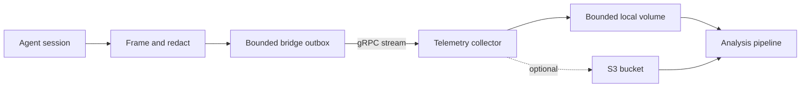

Telemetry collects analytics and inferred question/answer events. Live
[session status](session-status.md) is a separate structured-provider feature;
it works without telemetry and does not infer waits from this event stream.

Telemetry is opt-in. The bridge writes redacted events to a bounded local
outbox before it streams immutable segments to the collector over gRPC. The
collector durably writes the same segment format to its Docker volume and can
optionally upload it to S3.


```mermaid
flowchart LR
  Session[Agent session] --> Redact[Frame and redact]
  Redact --> Outbox[Bounded bridge outbox]
  Outbox -->|gRPC stream| Collector[Telemetry collector]
  Collector --> Volume[Bounded local volume]
  Collector -. optional .-> S3[S3 bucket]
  Volume --> Analysis[Analysis pipeline]
  S3 --> Analysis
```

## Collect derived question telemetry

### Isolated local Bridge/S3 smoke test

The repository-root `config.yaml` sends full redacted interaction events to
`https://bridge.orchael.dev` and uses enrollment credentials in
`/tmp/bridgectl-telemetry-test`. Start the Bridge stack with its S3 configuration
first. From the bridgectl repository root:

```bash
make build-cli
export BRIDGECTL_STATE_DIR=/tmp/bridgectl-telemetry-test
install -d -m 700 "$BRIDGECTL_STATE_DIR"
# Seed login's config discovery so it cannot fall back to your normal config.
# Keep an existing test enrollment config if this is a repeated run.
test -e "$BRIDGECTL_STATE_DIR/bridge.yaml" || (umask 077; cp config.yaml "$BRIDGECTL_STATE_DIR/bridge.yaml")
bin/bridgectl login --bridge https://bridge.orchael.dev
bin/bridgectl server start --config ./config.yaml --log-level info
```

In a second terminal, from the same repository root:

```bash
export BRIDGECTL_STATE_DIR=/tmp/bridgectl-telemetry-test
bin/bridgectl run --provider echo .
```

Type a short test message and press Enter. Wait a few seconds for delivery and
check the Bridge S3 prefix for new JSON objects containing `user_input` and
`provider_output`. Press **Ctrl-]** to detach. Use the same state-directory
export for `whoami`, `doctor`, `session list`, and `server stop`; otherwise those
commands target your normal installation. The daemon reads the repository config
explicitly; login updates only the seeded config and credentials in `/tmp`.
State includes the socket, enrollment, and telemetry spool.
If `/tmp` is cleared, repeat enrollment. This small test does not resolve the
known full-capture and upload-batching limitations.

### Standalone collector configuration

```yaml
telemetry:
  enabled: true
  collector_target: "127.0.0.1:9464"
  collector_insecure: true
  kinds: [session_started, session_context, question, answer, session_ended]
  include_redacted_text: true
  flush_interval: 10s
  max_disk_space: 1GB
```

Use `kinds: [all]` to retain both sides of the interaction as
`provider_output` and `user_input` events in addition to lifecycle, context,
question, and answer events. Full capture may contain personal or proprietary
material after best-effort redaction; enable it only with an appropriate
consent and retention policy.
Interaction records are buffered up to 1 MiB so secrets split across transport
chunks are redacted together. A larger record with no boundary within that budget is retained as
omission metadata (`buffer_limit`, byte count, and hash) rather than raw text.

The collector is a private-network component. Its `--tls-cert` and `--tls-key`
flags authenticate the collector server to bridgectl but do not authenticate
bridge clients. Any non-loopback deployment must use an operator-managed
network ACL or authenticated proxy. Native tenant/actor authentication is
tracked in [orchael/bridge#5](https://github.com/orchael/bridge/issues/5).

## Session identity and context

Schema-v2 sessions are keyed by `(source_id, session_id)`. A
`session_context` event records OS/architecture and Git branch/commit, plus
stable HMAC identifiers for the machine, repository, and working
directory. Raw paths, repository URLs and credentials, hostnames, Git author
identity, and environment variables are not collected.

```yaml
telemetry:
  # Empty values use private files under ~/.config/bridgectl/telemetry/.
  source_id: ""
  identity_key_file: ""

  # Optional descriptive labels; these are not authenticated identities.
  actor_id: "user-7"
  source_label: "engineering-laptop"
```

The identity key is 32 random bytes stored with mode `0600`. Preserve it to
join pseudonymous repository/directory activity over time; rotate it to break
that linkage. Authenticated tenant and actor attribution belongs in the
downstream collector/application, not in these descriptive labels.

Git discovery runs on the bounded telemetry worker rather than session startup.
Linked worktrees use the common repository metadata for repository identity.
Reconstruction ends a turn at missing sequences and emits long turns as
UTF-8-safe 64-KiB continuation chunks; logical-turn metrics do not count those
chunks as extra interventions.

## Operate and inspect the collector

```bash
make up-collector
make ps-collector
make logs-collector
make down-collector
```

`make reset-collector` removes the collector containers and volumes after an
interactive confirmation. If the collector is unavailable, the bridge keeps
retrying from its bounded outbox. When a disk budget is exhausted, the oldest
immutable segments are evicted and a structured warning is logged.

Reports read only sealed segments, so they may lag active traffic by at most
the configured flush interval. Run the built-in question report with:

```bash
bridgectl telemetry report --events ~/.config/bridgectl/telemetry/segments
```

For downstream design examples, run the non-production metrics/API/model-packet
sample documented in
[`examples/telemetry-analysis`](https://github.com/orchael/bridgectl/tree/main/examples/telemetry-analysis).
